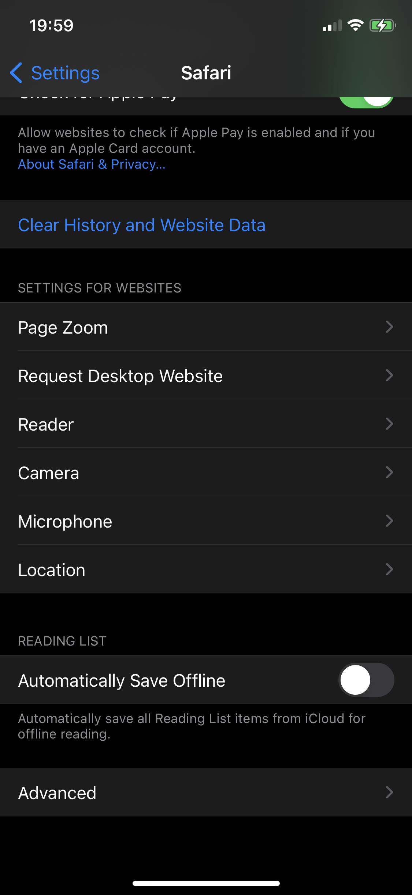
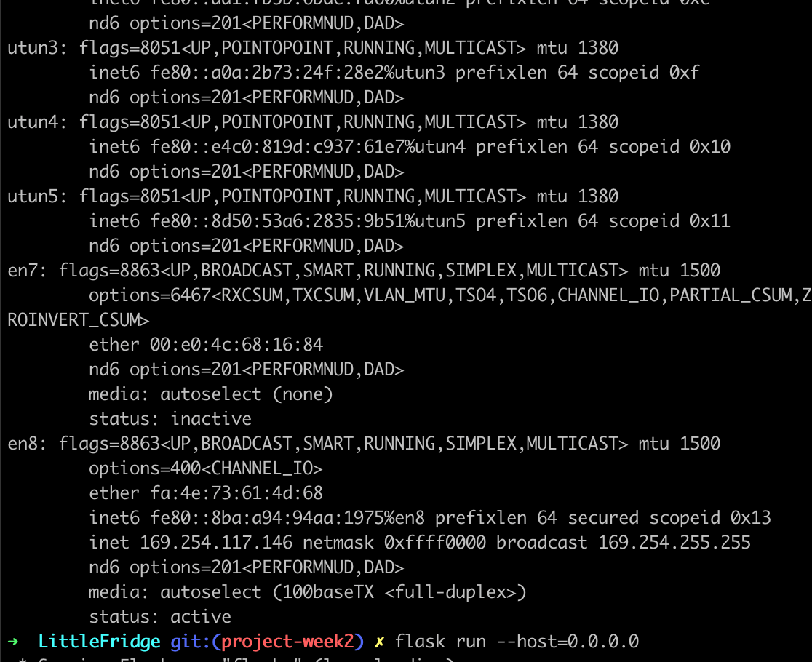

# Manual Test Plan For LittleFridge

This project implements a digital library to store the grocery information into the app.

## Prerequisites

This project was built on:
- Mac OS Big Sur
- React-Native
- Expo
- TypeScript
- Python (3.7)
- Flask
- MongoDB Atlas
- npm (newest version by 2021.04)
- pytest
- Spoonacular API (free external API, need to request for a key)
- jest
- optional: IOS iphone (11)
- optional: IDE (preferrly Pycharm, VS code, Webstorm)

Make sure these are installed before beginning. 

## Project Structure
There are two parts of the project:

`FridegApp` responsible for front-end construction for IOS app, with Model(`FridgeModel`)-Controller(`screens`)-View(`views`) being separated.

`LittleFridge` responsible for back-end API construction, and the main implementation is to construct a local database with itself. 

    __ root directory
        |__ FridgeApp
           |__ FridgeModel
              |__ FetchGrocery.ts
              |__ SpoonHelper.ts   
           |__ screens
              |__ TabOneScreen.tsx
              |__ ScannerScreen.tsx
           |__ views
              |__ FridgeView.tsx
           |__ navigation       
           |__ __test__
           
        |__ LittleFridge
           |__ flaskr
               |__ __init__.py
               |__ db.py
               |__ grocery.py   
               |__ recipe.py
               |__ auth.py (need further implement)   
           |_pytests

## Project Setup
	git clone https://gitlab.engr.illinois.edu/meic2/sp21-cs242-project.git directoryName

then, `cd directoryName`, here is the project source root

to make sure all the dependencies are installed, run

	cd FridgeApp
	npm install

go back to the root directory, to make sure the python dependencies are not depreciated,

    cd LittleFridge
    export PYTHONPATH = .
	
## Additional Set up on IOS phone
To set up the phone, use `Expo Go` app to simulate this app in a real phone scenario.
After registering, use usb to connect phone with laptop and make sure it is trusted.

In your iphone, go to `Setting > Safari > Advanced`

Click on Web_Inspector icon.

Now go to the mac Safari, you should be able to see Develop tab right now. Click on it and navigate to the following choices, and click on `Connect via Network`.

Then go to the terminal, run

    ifconfig

There should be several messages print out, select the last IP address shown up like this:
(this current address should be 169.254.255.255)

Change the variable `PHONE_IP_ADDRESS` in`FridgeModel/FridgeModel/env.ts` with this address. 
You should be able to run the local Flask with your phone accessing it right now.

## Start the project

to start the overall project with the local Flask API, you should first initiate the virtual environment.
    
    source pytest/bin/activate
    cd LittleFridge
    flask run --host=0.0.0.0 

to see the IOS front-end, 

    cd FridgeApp
    expo start

to test the pytests in the `LittleFridge` (with virtual environment open)
    
    cd LittleFridge
    pytest pytests/test_flaskr.py

to test typescript's utility function, run jest

    cd FridgeApp
    npx jest
         
## Structure of the App
The overall logic of the App:

- Fridge
    - the page is seperated into Barcode + scrollView
    - You can go to BarcodeScanner Page to scan grocery's page
        - if the barcode is recognised within the scope of the database we have, we will direct you to a view page of 
        auto-filled individual ingredient page. `...still implementing`
        - if the barcode cannot be recognized, we will direct you to individual ingredient page that need user to fill in the value. 
    - scrollView allows you to see all the grocery items in the digitalized fridge, and will update accordingly. 
- Recipe
    - `...still implementing`

### Fridge View
here you can see that the FridgeView is has two parts. 

If you click onto the scan button, you will see that the page looks like this:

Use the camera to focus on the barcode that you want to scan, 
(here we use the barcode from the pack of the diet coke as experiment) 

if successful the app will return with an alert:

Then, when you go back to the view, you will be able to see an update on the Fridge View:

 
If, however, you scan something (e.g. QR code) that you do not wish to scan,
then if an alert pop up, you can close the alert window, and tap again to scan again.

  
