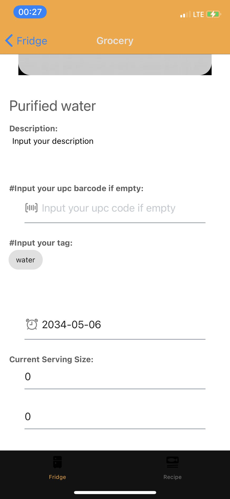

# Manual Test Plan For LittleFridge week 3

This project implements a digital library to store the grocery information into the app.

## Prerequisites

This project was built on:
- Mac OS Big Sur
- React-Native
- Expo
- TypeScript
- Python (3.7)
- Flask
- MongoDB Atlas
- npm (newest version by 2021.04)
- pytest
- Spoonacular API (free external API, need to request for a key)
- jest
- optional: IOS iphone (11)
- optional: IDE (preferrly Pycharm, VS code, Webstorm)

Make sure these are installed before beginning. 

## Project Structure
There are two parts of the project:

`FridegApp` responsible for front-end construction for IOS app, with Model(`FridgeModel`)-Controller(`screens`)-View(`views`) being separated.

`LittleFridge` responsible for back-end API construction, and the main implementation is to construct a local database with itself. 

    __ root directory
        |__ FridgeApp
           |__ FridgeModel
              |__ FetchGrocery.ts
              |__ FetchRecipe.ts
              |__ SpoonHelper.ts   
           |__ screens
              |__ TabOneScreen.tsx
              |__ ScannerScreen.tsx
              |__ TabTwoScreen.tsx
              |__ RecipeScreen.tsx
           |__ views
              |__ FridgeListView.tsx
              |__ FridgeOverallView.tsx
              |__ GroceryView.tsx
              |__ LoadingView.tsx
              |__ RecipeView.tsx
              |__ RecipeMemoView.tsx
           |__ navigation       
           |__ __test__
           
        |__ LittleFridge
           |__ flaskr
               |__ __init__.py
               |__ db.py
               |__ grocery.py   
               |__ recipe.py
               |__ auth.py (need further implement)   
           |_pytests

## Project Setup
	git clone https://gitlab.engr.illinois.edu/meic2/sp21-cs242-project.git directoryName

then, `cd directoryName`, here is the project source root

to make sure all the dependencies are installed, run

	cd FridgeApp
	npm install

go back to the root directory, to make sure the python dependencies are not depreciated,

    cd LittleFridge
    export PYTHONPATH = .
	
## Additional Set up on IOS phone
To set up the phone, use `Expo Go` app to simulate this app in a real phone scenario.
After registering, use usb to connect phone with laptop and make sure it is trusted.

In your iphone, go to `Setting > Safari > Advanced`

Click on Web_Inspector icon.

Now go to the mac Safari, you should be able to see Develop tab right now. Click on it and navigate to the following choices, and click on `Connect via Network`.

Then go to the terminal, run

    ifconfig

There should be several messages print out, select the last IP address shown up like this:
(this current address should be 169.254.255.255)

Change the variable `PHONE_IP_ADDRESS` in`FridgeModel/FridgeModel/env.ts` with this address. 
You should be able to run the local Flask with your phone accessing it right now.

## Start the project

to start the overall project with the local Flask API, you should first initiate the virtual environment.
    
    source pytest/bin/activate
    cd LittleFridge
    flask run --host=0.0.0.0 

to see the IOS front-end, 

    cd FridgeApp
    expo start

to test the pytests in the `LittleFridge` (with virtual environment open)
    
    cd LittleFridge
    pytest pytests/test_flaskr.py

to test typescript's utility function, run jest

    cd FridgeApp
    npx jest
         
## Structure of the App
The overall logic of the App:

- Fridge
    - the page is separated into Barcode scanner and search bar + scrollView
        - search bar:
            - you can search the grocery that you have by name
        - You can go to BarcodeScanner Page to scan grocery's page `...still implementing`
            - if the barcode is recognised within the scope of the database we have, we will direct you to a view page of 
            auto-filled individual ingredient page. 
            - if the barcode cannot be recognized, we will direct you to individual ingredient page that need user to fill in the value. 
        - scrollView allows you to see all the grocery items in the digitalized fridge, and will update accordingly. 
    - individual grocery page:
        - if you click into the list of the items in the digital fridge, you can see your grocery page with specific information
        - you can also update the item, and going back to the former page will refresh the page
- Recipe
    - search bar allows the user to search for recipe `still implementing`
    - scrollView allows you to see all the recipe items in the memo of the recipe that user records, and will update accordingly. 
    - individual recipe page:
        - if you click into the list of the items in the digital fridge, you can see your recipe page with specific information
        - you can also update the item, and going back to the former page will refresh the page
- recipeSearching `still implementing`

### Fridge View
here you can see that the FridgeListView is has two parts. 

You can click on the search bar and type in the names that you want to search. 

`still implementing...`

If you click onto the scan button, you will see that the page looks like this:

Use the camera to focus on the barcode that you want to scan, 
(here we use the barcode from the pack of the diet coke as experiment) 

If you scan something (e.g. QR code) that you do not wish to scan,
then if an alert pop up, you can close the alert window, and tap again to scan again.

if successful the app will return with an alert:

Then, after click Okay, the navigator will automatically direct the user to the ingredient page. 

#### Grocery View

There are two part of the scenario: if the barcode cannot be recognized by the external API database, or they can be recorgnized.

1. if it is recognized, the ingredient page will appear with every information of the external API.
You can edit whatever part of information you like except the upc bar code page, as this will be the fixed key for the database.

 
 
2 . if it is not recognized by the external API (they don't have this item/this barcoe in theire database)
the ingredient page will appear with empty ingredient page that directs you to input everything. 

after clicking on okay, user should be able to see the individual grocery with input space. 

The tag can also flexibally input using `space` to split the tags. 

  
After hit the submit button, if the server correctly uploads the information, the alert will show up:

Else, if the date format is input in a wrong way, or the server could not upload the information, the alert will notify the user. 

After confirming the submit button, user could edit the page again based on his/her wish, or they could go back to the fridge view. 
Now they can see that the fridge view is update correctly. 

### Recipe List

Here is the screenshot for the recipe list view. Here the user can see whatever they've created before. 
when clicking on the individual item, the app will directs the user to the individual recipe view as well. 

### Recipe (Individual)

This recipe view is similiar to the grocery view, which will show the created date, the ingredients, the description and the image. 
