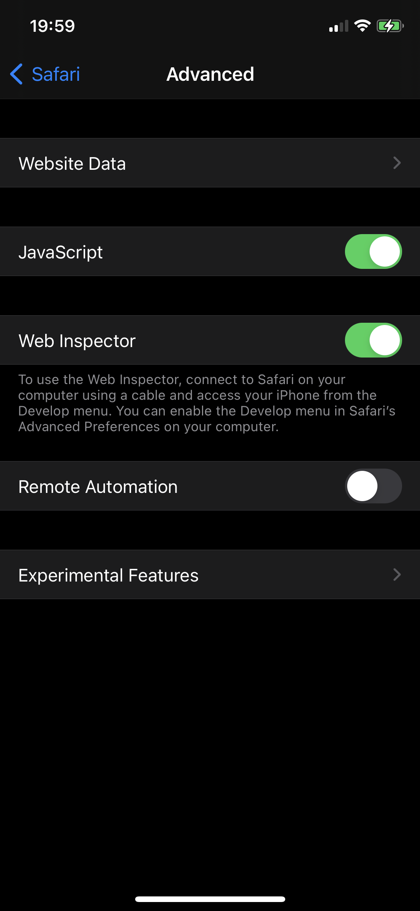
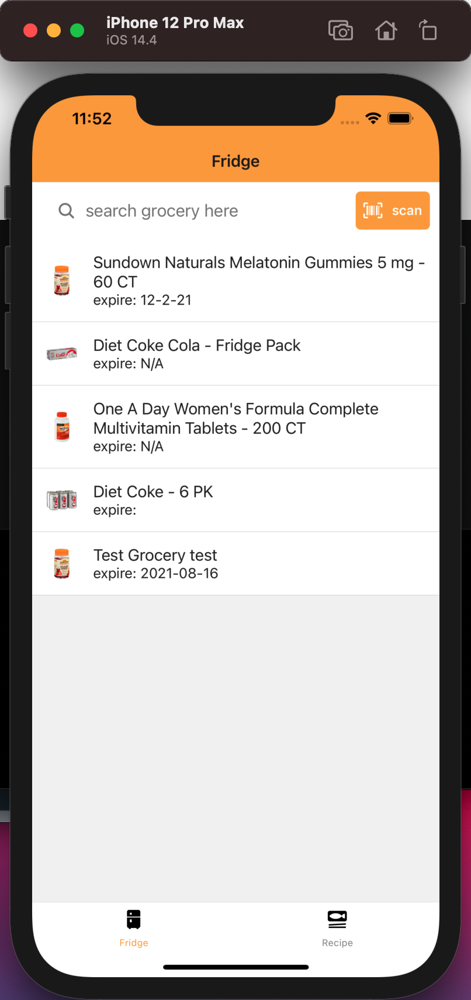
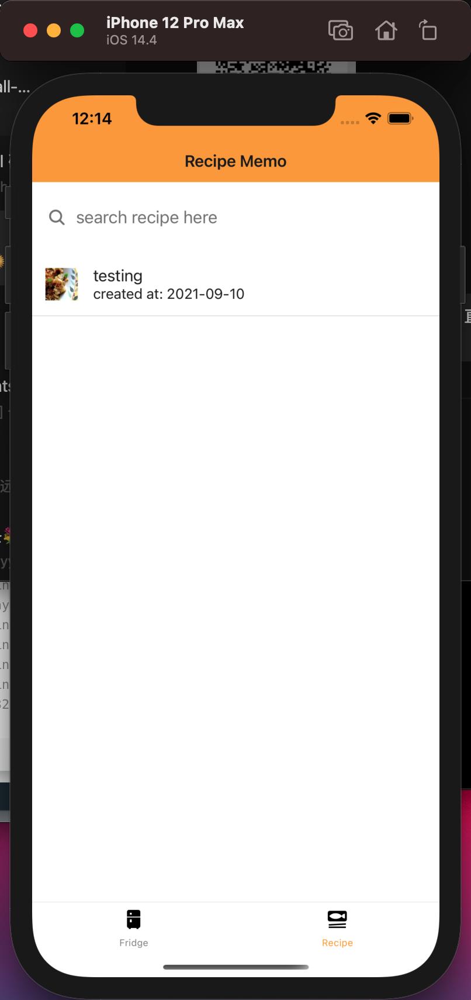

# Manual Test Plan For LittleFridge week 3

This project implements a digital library to store the grocery information into the app.

## Prerequisites

This project was built on:
- Mac OS Big Sur
- React-Native
- Expo
- TypeScript
- Python (3.7)
- Flask
- MongoDB Atlas
- npm (newest version by 2021.04)
- pytest
- Spoonacular API (free external API, need to request for a key)
- jest
- optional: IOS iphone (11)
- optional: IDE (preferrly Pycharm, VS code, Webstorm)

Make sure these are installed before beginning. 

## Project Structure
There are two parts of the project:

`FridegApp` responsible for front-end construction for IOS app, with Model(`FridgeModel`)-Controller(`screens`)-View(`views`) being separated.

`LittleFridge` responsible for back-end API construction, and the main implementation is to construct a local database with itself. 

    __ root directory
        |__ FridgeApp
           |__ FridgeModel
              |__ FetchGrocery.ts
              |__ FetchRecipe.ts
              |__ SpoonHelper.ts   
           |__ screens
              |__ TabOneScreen.tsx
              |__ ScannerScreen.tsx
              |__ TabTwoScreen.tsx
              |__ RecipeScreen.tsx
              |__ TabThreeScreen.tsx
              |__ SearchRecipe.tsx
           |__ views
              |__ FridgeListView.tsx
              |__ FridgeOverallView.tsx
              |__ GroceryView.tsx
              |__ LoadingView.tsx
              |__ RecipeView.tsx
              |__ RecipeMemoView.tsx
              |__RecipeSearchView.tsx
           |__ navigation       
           |__ __test__
           
        |__ LittleFridge
           |__ flaskr
               |__ __init__.py
               |__ db.py
               |__ grocery.py   
               |__ recipe.py
               |__ auth.py (need further implement)   
           |_pytests

## Project Setup
	git clone https://gitlab.engr.illinois.edu/meic2/sp21-cs242-project.git directoryName

then, `cd directoryName`, here is the project source root

to make sure all the dependencies are installed, run

	cd FridgeApp
	npm install

go back to the root directory, to make sure the python dependencies are not depreciated,

    cd LittleFridge
    export PYTHONPATH = .
	
## Additional Set up on IOS phone
To set up the phone, use `Expo Go` app to simulate this app in a real phone scenario.
After registering, use usb to connect phone with laptop and make sure it is trusted.

In your iphone, go to `Setting > Safari > Advanced`

Click on Web_Inspector icon.

Now go to the mac Safari, you should be able to see Develop tab right now. Click on it and navigate to the following choices, and click on `Connect via Network`.

Then go to the terminal, run

    ifconfig

There should be several messages print out, select the last IP address shown up like this:
(this current address should be 169.254.255.255)

Change the variable `PHONE_IP_ADDRESS` in`FridgeModel/FridgeModel/env.ts` with this address. 
You should be able to run the local Flask with your phone accessing it right now.

## Start the project

to start the overall project with the local Flask API, you should first initiate the virtual environment.
    
    source pytest/bin/activate
    cd LittleFridge
    flask run --host=0.0.0.0 

to see the IOS front-end, 

    cd FridgeApp
    expo start

to test the pytests in the `LittleFridge` (with virtual environment open)
    
    cd LittleFridge
    pytest pytests/test_flaskr.py

to test typescript's utility function, run jest

    cd FridgeApp
    npx jest
         
## Structure of the App
The overall logic of the App:

- Fridge
    - the page is separated into Barcode scanner and search bar + scrollView
        - search bar:
            - you can search the grocery that you have by name
        - You can go to BarcodeScanner Page to scan grocery's page `...still implementing`
            - if the barcode is recognised within the scope of the database we have, we will direct you to a view page of 
            auto-filled individual ingredient page. 
            - if the barcode cannot be recognized, we will direct you to individual ingredient page that need user to fill in the value. 
        - scrollView allows you to see all the grocery items in the digitalized fridge, and will update accordingly. 
    - individual grocery page:
        - if you click into the list of the items in the digital fridge, you can see your grocery page with specific information
        - you can also update the item, and going back to the former page will refresh the page
- Recipe
    - search bar allows the user to search for recipe `still implementing`
    - scrollView allows you to see all the recipe items in the memo of the recipe that user records, and will update accordingly. 
    - individual recipe page:
        - if you click into the list of the items in the digital fridge, you can see your recipe page with specific information
        - you can also update the item, and going back to the former page will refresh the page
- recipeSearching `still implementing`

### Fridge View
(I've deleted the irrelevant part of the manualTestplan, mainly scanning part.)

here you can see that the FridgeListView is has two parts. for the search bar, if there is nothing inputted in the search bar, the fridge will show all the grocery items. 

 If the user input anything they want to search, for example `diet`, the search bar will automatically search on matched item (Now, the functionally only includes the match on the name of the grocery, but not the expiration date.)
 
 
 
 
### Recipe List

Here is the screenshot for the recipe list view. Here the user can see whatever they've created before. 
when clicking on the individual item, the app will directs the user to the individual recipe view as well. 

The same goes for the implementation of the recipe search bar. If the recipe search bar enter the title o the recipe that the user want to search on, the view will dynamically show all the matched recipe. 

  

### Recipe Search

This page connects with the external database `spoonacular API`, and will randomly pop up various recipes if nothing entered. 

However, if once the user type in the recipe search bar for this screen, it will search based on the matched recipes. 

When the user limit the maximum number of the recipes they want to see, they can use the slider to limit the maximum number. 

It's also plausible to sort the dropdown menus based on whether the user want to see the recomended recipes based on the healthiness rate given by the spoonacular. 
Then, click on the switch and the sorting is changed. 

If you click on to any one of the recipe, you will see the detailed description showing up. 
As before, the user is allowed to change all the field to customize their own menu. 

And after clicking on submitting (with entering the created_date field), the user now has submit the recipe to their own local database!

When the user navigate back to his/her own memo page, they can see that the `Packsitan Chicken` is already in the database, with the created-date listed as description correctly.

